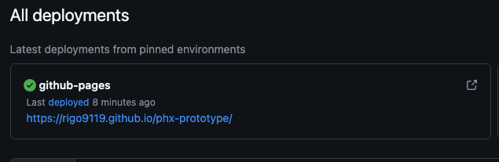
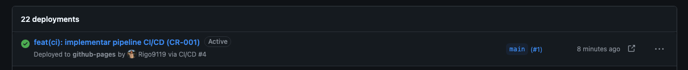
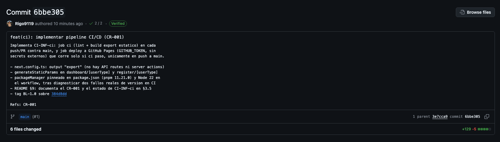

# Plan de Gestión de Configuración de Software — Proyecto Quimera

**Repositorio técnico:** `phx-prototype`
**Curso:** Gestión de Configuración y Mantenimiento de Software
**Programa:** Maestría en Ingeniería de Software, Facultad de Ingeniería
**Institución:** Universidad de La Sabana
**Profesor:** César Vega Fernández
**Autor:** Rigo Armando Rosero Castillo
**Fecha:** Agosto 2026

> **Nota de nomenclatura.** Por el acuerdo de anonimización establecido en el diagnóstico previo de esta serie de actividades (*Mantenimiento y Evolución del Software: Análisis de Quimera*, julio 2026), el sistema se referencia como **Quimera**. El nombre técnico interno del código fuente, tal como aparece en `package.json` y en el repositorio, es `phx-prototype`. Ambos nombres identifican el mismo sistema.

---

## Tabla de contenido

1. [Contexto y alcance](#1-contexto-y-alcance)
2. [Estándares de referencia](#2-estándares-de-referencia)
3. [Identificación de configuration items (CI)](#3-identificación-de-configuration-items-ci)
4. [Definición de baselines](#4-definición-de-baselines)
5. [Estrategia de control de cambios](#5-estrategia-de-control-de-cambios)
6. [Definición de trazabilidad](#6-definición-de-trazabilidad)
7. [Modelo de gestión de configuración propuesto](#7-modelo-de-gestión-de-configuración-propuesto)
8. [Puesta en marcha del prototipo](#8-puesta-en-marcha-del-prototipo)
9. [Implementación de Change Requests (CR-001, CR-002, CR-003)](#9-implementación-de-change-requests-cr-001-cr-002-cr-003)
10. [Síntesis del modelo de gestión de configuración](#10-síntesis-del-modelo-de-gestión-de-configuración)
11. [Referencias](#11-referencias)

---

## 1. Contexto y alcance

Quimera es una plataforma web que conecta dos tipos de usuario: un **cliente/dreamer** que propone un proyecto y solicita financiación, y un **inversionista** que evalúa y financia ese proyecto (le "presta" el dinero). Un tercer rol, **admin**, administra la plataforma y supervisa las transacciones. El diagnóstico previo identificó cinco servicios lógicos objetivo: `Login/Auth`, `Transactions`, `Proyect`, `User` y `Payments`.

El estado del repositorio al momento del diagnóstico correspondía exactamente a lo descrito en ese documento: **solo existía el frontend**, construido en Next.js 15 (App Router) + React 19 + TypeScript, con datos "quemados" en módulos de mock data (`data/mockdata/*`), sin backend accesible ni persistencia real, sin el servicio `Login/Auth`, y sin pruebas unitarias ni de integración. Esta es la causa raíz por la que este documento trata al frontend como una **base de partida auditable**, no como un sistema completo — y por la que las dos primeras Change Requests ejecutadas sobre este plan (CR-002, CR-003; §9.5–§9.7) atacan directamente esos dos últimos puntos: formularios sin validar ni probar, y ausencia total de `Login/Auth`. El backend real (Supabase/Postgres) sigue sin existir en este repositorio — deuda pendiente para BL-1.2.

El objetivo de este documento es distinto al de la actividad anterior. El diagnóstico identificó *qué salió mal* (ambigüedad de alcance, rotación de equipo, cambios de stack sin gobierno, ausencia de documentación y de pruebas). Este documento propone el **mecanismo de gestión de configuración** que, de retomarse el proyecto, evita que esos mismos problemas se repitan: cómo se identifican y versionan los componentes (CI), cómo se congelan puntos de referencia estables (baselines), cómo se autoriza y registra cualquier cambio — incluyendo cambios de arquitectura o de stack, que fueron el origen de buena parte de la deuda técnica — y cómo se traza cada cambio hasta el requerimiento y el hallazgo que lo motiva.

---

## 2. Estándares de referencia

| Estándar | Uso en este documento |
|---|---|
| **IEEE 828-2012** — *Standard for Configuration Management in Systems and Software Engineering* | Estructura general del plan: identificación de CI, control de cambios, contabilización de estado (status accounting) y auditoría de configuración. |
| **ISO/IEC/IEEE 12207:2017** — *Software Life Cycle Processes* | Ubica la gestión de configuración como proceso de soporte transversal al ciclo de vida, coherente con el proceso de mantenimiento (ISO/IEC 14764) citado en el diagnóstico previo. |
| **Conventional Commits 1.0.0** | Convención de mensajes de commit usada para automatizar versionado semántico y generación de *changelog*. |
| **Semantic Versioning 2.0.0** | Esquema de versionado de baselines y paquetes. |

No se exigen normas APA por tratarse de un entregable en formato `README.md`, según lo indicado en la guía de la actividad.

---

## 3. Identificación de configuration items (CI)

Un **configuration item (CI)** es cualquier artefacto que se pone bajo control de configuración porque cambia de forma independiente y su versión debe poder reconstruirse en cualquier momento (IEEE 828-2012, §4). Se identificaron los CI reales del repositorio, agrupados por categoría, y se les asignó un identificador estable.

**Convención de nombres:** `CI-<CATEGORÍA>-<dominio>-<secuencial>`, donde `CATEGORÍA` ∈ `{SRC, CFG, DAT, DOC, INF}`.

### 3.1 CI de código fuente (SRC)

| ID | CI | Ruta | Dominio funcional | Responsable |
|---|---|---|---|---|
| CI-SRC-app-01 | Landing y enrutamiento de acceso | `app/page.tsx`, `app/layout.tsx` | Acceso / navegación | Rigo Rosero |
| CI-SRC-app-02 | Registro de usuario | `app/register/[userType]/page.tsx` | Servicio `User` | Rigo Rosero |
| CI-SRC-app-03 | Dashboard por tipo de usuario | `app/dashboard/[userType]/page.tsx` y `components/charts/*` | Servicio `Proyect`, `Payments` | Rigo Rosero |
| CI-SRC-app-04 | Panel de administración | `app/admin/page.tsx`, `app/admin/components/table/columns.tsx` | Servicio `Transactions` | Rigo Rosero |
| CI-SRC-cmp-01 | Formularios de dominio | `components/forms/**` | Servicios `User`, `Proyect` | Rigo Rosero |
| CI-SRC-cmp-02 | Tabla de datos genérica | `components/dataTable/dataTable.tsx` | Transversal | Rigo Rosero |
| CI-SRC-cmp-03 | Estados de cuenta | `components/statements/*` | Servicio `Payments` | Rigo Rosero |
| CI-SRC-cmp-04 | Sistema de diseño (UI primitives) | `components/ui/**` | Transversal | Rigo Rosero |
| CI-SRC-lib-01 | Contrato de tipos del dominio | `lib/types.ts` | Transversal | Rigo Rosero |
| CI-SRC-lib-02 | Constantes de dominio | `lib/constatns.ts`¹ | Transversal | Rigo Rosero |
| CI-SRC-lib-03 | Schemas de validación | `lib/schemas/*` | Transversal (`User`, `Proyect`, auth) | Rigo Rosero |
| CI-SRC-lib-04 | Autenticación y autorización | `lib/auth/*`, `components/auth/**` | Servicio `Login/Auth` (BL-1.1) | Rigo Rosero |

¹ Nombre de archivo tal como existe en el repositorio; ver hallazgo de trazabilidad §6.

### 3.2 CI de datos (DAT)

Estos CI sustituyen temporalmente al servicio `Payments`/`Proyect`/`User`/`Transactions` mientras no existe backend. Se versionan igual que el código porque son la única fuente de verdad del comportamiento observable del prototipo.

| ID | CI | Ruta | Sustituye a |
|---|---|---|---|
| CI-DAT-users | Mock de usuarios | `data/mockdata/users.ts` | Servicio `User` |
| CI-DAT-statements | Mock de estados de cuenta | `data/mockdata/statements.ts` | Servicio `Payments` |
| CI-DAT-cuotas | Mock de cuotas | `data/mockdata/cuotas.ts` | Servicio `Payments` |
| CI-DAT-transactions | Mock de transacciones | `data/mockdata/transactions.ts` | Servicio `Transactions` |
| CI-DAT-credentials | Mock de credenciales | `data/mockdata/credentials.ts` | Servicio `Login/Auth` — separado de `CI-DAT-users` a propósito, ver `docs/adr/0001` |

### 3.3 CI de configuración y build (CFG)

| ID | CI | Ruta | Efecto si cambia |
|---|---|---|---|
| CI-CFG-pkg | Manifiesto y dependencias | `package.json`, `pnpm-lock.yaml` | Afecta reproducibilidad del build completo |
| CI-CFG-workspace | Topología del workspace pnpm | `pnpm-workspace.yaml` | Afecta resolución de paquetes; base para una futura separación en `apps/`/`packages/` |
| CI-CFG-ts | Compilador TypeScript | `tsconfig.json` | Afecta *strictness* y superficie de tipos válida |
| CI-CFG-next | Framework | `next.config.ts` | Afecta build/runtime de Next.js |
| CI-CFG-tw | Tema visual | `tailwind.config.ts`, `app/globals.css` | Afecta todo el sistema de diseño |
| CI-CFG-shadcn | Generador de componentes UI | `components.json` | Afecta convención de alias y estilo de componentes nuevos |
| CI-CFG-lint | Reglas de calidad estática | `eslint.config.mjs` | Afecta el gate de calidad en CI |

### 3.4 CI de documentación (DOC)

| ID | CI | Ruta | Naturaleza |
|---|---|---|---|
| CI-DOC-readme | Este documento (plan de SCM) | `README.md` | Editable manualmente |
| CI-DOC-diagnostico | Diagnóstico de mantenimiento previo | *externo* (Análisis de Quimera, jul. 2026) | Insumo, no versionado en este repo |
| CI-DOC-adr | Registro de decisiones de arquitectura | `docs/adr/*` | Ver §5.3 — `0001-client-side-auth-under-static-export.md` creado en CR-003 |
| CI-DOC-changelog | Historial de versiones | `CHANGELOG.md` (propuesto) | **Autogenerado**, nunca editado a mano |

### 3.5 CI de infraestructura (INF)

| ID | CI | Estado actual |
|---|---|---|
| CI-INF-repo | Repositorio Git (`github.com/Rigo9119/phx-prototype`) | Rama `main` protegida (requiere PR + check `ci` en verde), historial etiquetado con baselines (`BL-1.0` sobre el commit `384d8dd`) |
| CI-INF-backend | Backend / base de datos (Supabase-Postgres, según diagnóstico) | **No existe en este repositorio** — deuda pendiente identificada en el diagnóstico |
| CI-INF-ci | Pipeline de integración continua | **Implementado** en `.github/workflows/ci-cd.yml` — ver §9 |

---

## 4. Definición de baselines

Una **baseline** es una fotografía formalmente revisada y congelada de un conjunto de CI que sirve de punto de partida estable para el trabajo siguiente y solo cambia mediante un procedimiento de control de cambios (IEEE 828-2012, §3.1.3). Se definen tres tipos, adaptados del ciclo clásico *functional / allocated / product baseline*:

| Tipo | Qué congela | Cuándo se establece |
|---|---|---|
| **Baseline funcional (FBL)** | Alcance y requerimientos acordados | Antes de iniciar desarrollo de un incremento |
| **Baseline asignada (ABL)** | Diseño/arquitectura de los CI que implementan la FBL | Al cerrar el diseño técnico del incremento |
| **Baseline de producto (PBL)** | Código + configuración + datos ya implementados y verificados | Al cerrar el incremento, etiquetada en Git |

### 4.1 Línea de tiempo de baselines de Quimera

```
BL-0.0                    BL-1.0 (ACTUAL)         BL-1.1          BL-1.2              BL-1.3           BL-2.0
Legado Ruby/Angular   →   Frontend MVP        →   Auth/Autoriz. → Backend real     →  Cobertura     →  Release
+ intento Supabase        (este repositorio)      (propuesta)     (Supabase/Postgres) de pruebas       candidate
No reproducible            commit 384d8dd                          (propuesta)         (propuesta)      (propuesta)
Solo referencia histórica  PBL congelada
```

| Baseline | Estado | Contenido | CI incluidos |
|---|---|---|---|
| **BL-0.0** — Legado | Histórico, no reproducible | Backend Ruby on Rails + frontend AngularJS, y el intento posterior con Supabase. Repos no accesibles según el diagnóstico. | N/A — solo se documenta como antecedente |
| **BL-1.0** — Frontend MVP (**baseline actual de este repositorio**) | **PBL vigente** | Todo lo listado en §3.1–§3.3, en el estado del commit `384d8dd` (rama `main`) | CI-SRC-*, CI-DAT-*, CI-CFG-* |
| **BL-1.1** — Autenticación y autorización | Contenido implementado en CR-003; baseline formal aún sin etiquetar (decisión de CCB pendiente) | Servicio `Login/Auth`: `AuthProvider`, guardado de rutas del lado del cliente, login/registro | CI-SRC-app-02 extendido, `CI-SRC-lib-04`, `CI-DAT-credentials`, `CI-DOC-adr` |
| **BL-1.2** — Backend real | Propuesta | Reemplazo de CI-DAT-* por integraciones a Supabase/Postgres para `User`, `Proyect`, `Payments`, `Transactions` | CI-DAT-* migran a CI-SRC-*/CI-INF-backend |
| **BL-1.3** — Cobertura de pruebas | Contenido implementado en CR-002/CR-003 (Vitest, no Jest — ver §9.5); baseline formal aún sin etiquetar | Suite de pruebas unitarias e integración, 48 pruebas / ~87% statements sobre formularios y auth | `CI-SRC-lib-03`, pruebas co-ubicadas junto a cada CI de código |
| **BL-2.0** — Release candidate | Propuesta | Endurecimiento de seguridad, definición de términos legales (vacío señalado en el diagnóstico), pipeline de CI/CD activo | Todos los anteriores + CI-INF-ci |

**Regla de congelamiento:** cada baseline se marca con un *tag* de Git anotado (`git tag -a BL-1.0 -m "..."`) sobre el commit exacto que la compone. Ningún CI dentro de una baseline cerrada se modifica sin pasar por el procedimiento de la §5; el cambio da lugar a una baseline nueva, nunca a una edición retroactiva de la anterior.

---

## 5. Estrategia de control de cambios

El diagnóstico atribuye buena parte del fracaso del proyecto a cambios sin gobierno: migración de stack (Ruby→Supabase, AngularJS→React) decidida sin registro, pausas y reanudaciones del cliente sin re-alineación de alcance, y rotación de equipo sin traspaso documentado. La estrategia que sigue ataca directamente esas tres causas.

### 5.1 Flujo de una solicitud de cambio (Change Request)

```
 1. Solicitud de cambio (CR)
        │
        ▼
 2. ¿Afecta arquitectura o stack tecnológico?
        │                              │
       Sí                              No
        │                              │
        ▼                              │
 3. Redactar ADR                       │
    (docs/adr/NNNN-titulo.md)          │
        │                              │
        ▼                              │
 4. Revisión CCB                       │
        │                              │
   ┌────┴────┐                         │
 Rechazado  Aprobado                   │
   │           │                       │
   ▼           └──────────┬────────────┘
 CR cerrada                ▼
 (rechazada)     5. Branch de feature
                  (feat/CR-ID-descripcion)
                            │
                            ▼
                  6. Pull Request
                  (commits Conventional Commits)
                            │
                            ▼
                  7. Checks automáticos
                  (lint + build + tests)
                            │
                     ┌──────┴──────┐
                   Falla          Pasa
                     │              │
                     │              ▼
                     │      8. Revisión de código
                     │              │
                     │      ┌───────┴───────┐
                     │  Cambios         Aprobado
                     │ solicitados          │
                     │      │               ▼
                     └──────┘      9. Merge a main
                                            │
                                            ▼
                              10. ¿Cierra un incremento de baseline?
                                    │                  │
                                   Sí                  No
                                    │                  │
                                    ▼                  ▼
                     11. Tag de nueva baseline   Queda en main
                         (BL-x.y)                (sin tag de baseline)
```

### 5.2 Plantilla de Change Request (CR)

Toda modificación a un CI bajo control — incluida la actual `main` — se registra como un *issue* de GitHub con esta plantilla mínima:

```
CR-ID:            CR-<secuencial>
Título:
Solicitante:
CI afectados:      (IDs de la §3, ej. CI-SRC-app-03, CI-DAT-statements)
Tipo de cambio:     [ ] Correctivo  [ ] Adaptativo  [ ] Perfectivo  [ ] Preventivo
                     (categorías consistentes con el diagnóstico previo)
¿Cambia arquitectura o stack?  [ ] Sí (requiere ADR)   [ ] No
Justificación:
Impacto / riesgo:
Baseline de origen:
Baseline destino (si aplica):
```

### 5.3 Comité de Control de Cambios (CCB) y ADR

Con un equipo de un solo desarrollador — la misma condición que, sin gobierno, causó los cambios de stack no documentados del proyecto original — el CCB se mantiene como **rol formal aunque sea ejercido por la misma persona**: antes de aprobar un CR que toca arquitectura o tecnología, el autor debe producir un **Architecture Decision Record (ADR)** en `docs/adr/`, con el formato estándar (contexto, decisión, alternativas consideradas, consecuencias). Esto es exactamente lo que faltó al pasar de Ruby/Angular a Supabase/React: ninguna decisión quedó registrada, por lo que ningún equipo posterior pudo entender el porqué. El ADR es en sí mismo un CI (CI-DOC-adr, §3.4) y queda bajo el mismo control de versiones que el código.

Si el equipo crece, el CCB se formaliza como los roles de `CODEOWNERS` de GitHub sobre las rutas de la §3, sin cambiar el procedimiento.

### 5.4 Estrategia de ramas y versionado

- **Modelo de ramas:** *trunk-based* con ramas de vida corta `feat/`, `fix/`, `chore/`, nombradas `<tipo>/CR-<id>-<slug>`. `main` permanece siempre desplegable.
- **Mensajes de commit:** Conventional Commits (`feat:`, `fix:`, `refactor:`, `chore:`, `docs:`), lo que permite generar automáticamente el CI-DOC-changelog — nunca editado a mano, conforme a la convención de que los artefactos autogenerados no se tocan manualmente.
- **Versionado:** SemVer (`MAJOR.MINOR.PATCH`) por baseline de producto; un `MAJOR` solo se incrementa en un cambio de BL con ruptura de compatibilidad (p. ej. BL-1.x → BL-2.0).
- **Protección de rama:** `main` requiere PR con al menos un check de CI en verde (lint + build; tests cuando exista BL-1.3) antes de merge, incluso en solitario, para dejar rastro auditable — el rastro que el diagnóstico señala como ausente en el proyecto original.

---

## 6. Definición de trazabilidad

La trazabilidad conecta cada CI con el requerimiento/hallazgo que lo origina, la baseline a la que pertenece y el mecanismo de verificación aplicable. Esto responde directamente al problema que el diagnóstico marca como raíz: *"sin unos requerimientos claros los avances... no mostraban el progreso que el proyecto de verdad requería."* Sin una matriz de trazabilidad, no hay forma de confirmar que un cambio efectivamente cierra el hallazgo que lo motivó.

### 6.1 Matriz de trazabilidad (extracto representativo)

| Hallazgo / requerimiento origen | CI que lo implementa | Baseline | Verificación |
|---|---|---|---|
| Servicio `User` (registro de inversionista/dreamer) | CI-SRC-app-02, CI-DAT-users | BL-1.0 | Verificación manual de flujo (sin backend aún) |
| Servicio `Proyect` (creación de solicitud de financiación) | `components/forms/createProyectForm`, `components/sheets/createProyectSheet` | BL-1.0 | Verificación manual |
| Servicio `Payments` (cuotas y estados de cuenta) | CI-SRC-app-03, CI-SRC-cmp-03, CI-DAT-statements, CI-DAT-cuotas | BL-1.0 | Verificación manual |
| Servicio `Transactions` (panel admin) | CI-SRC-app-04, CI-DAT-transactions | BL-1.0 | Verificación manual |
| Servicio `Login/Auth` (no implementado — deuda técnica confirmada en el diagnóstico) | `lib/auth/*`, `components/auth/routeGuard`, `app/login` | BL-1.1 (implementado en CR-003, ver §9.6) | 8 pruebas (`authContext`, `roleToRouteSegment`) + verificación manual del flujo completo |
| Mantenimiento preventivo: falta de validación de formularios (ejemplo citado en el diagnóstico) | `lib/schemas/*`, `components/forms/utils/getFieldError.ts`, wiring en `registerForm`/`createProyectForm`/`loginForm` | BL-1.0 (implementado en CR-002, ver §9.5) | Pruebas automatizadas por schema y por formulario — brecha cerrada |
| Falta de pruebas unitarias/integración (hallazgo central del diagnóstico) | Vitest + Testing Library, 48 pruebas | BL-1.3 (implementado en CR-002/CR-003) | `pnpm test` / `pnpm test:coverage` — ver §9.7 |
| Ausencia de documentación técnica que "diera visión del proyecto" (hallazgo del diagnóstico) | CI-DOC-readme (este documento), CI-DOC-adr (propuesto) | BL-1.0 en adelante | Revisión de CCB en cada CR de arquitectura |
| Cambios de stack sin gobierno (Ruby→Supabase, Angular→React) | CI-DOC-adr obligatorio para CR de arquitectura (§5.3) | A partir de BL-1.1 | Ningún CR de arquitectura se aprueba sin ADR |

### 6.2 Mecanismo de trazabilidad hacia adelante

Cada commit referencia su `CR-ID` en el pie del mensaje (`Refs: CR-014`), y cada Pull Request enlaza el *issue* de la CR. Esto permite reconstruir, para cualquier CI, la cadena completa: **requerimiento → CR → ADR (si aplica) → commits → baseline → verificación**, sin depender de memoria institucional — precisamente lo que la rotación de equipo destruyó en el proyecto original.

### 6.3 Hallazgo de higiene menor

Durante la identificación de CI se encontró que `lib/constatns.ts` (CI-SRC-lib-02) tiene un error tipográfico en el nombre de archivo (`constatns` en vez de `constants`) y que `data/mockdata/users.ts` usa la llave `npiType`, mientras `lib/types.ts` declara el campo como `npyType` en el tipo `User`. Se documentan aquí como hallazgos de trazabilidad de datos — no se corrigen en este entregable para no invalidar la baseline BL-1.0 fuera de un CR formal, conforme a la propia estrategia de control de cambios definida en la §5.

Durante la exploración previa a CR-002/CR-003 (§9.5, §9.6) se encontraron dos hallazgos adicionales de la misma naturaleza, tampoco corregidos aquí por la misma razón:

- `data/mockdata/users.ts` usa la llave `phone`, mientras `lib/types.ts` declara el campo como `cellphone` en el tipo `User` — mismo patrón que `npiType`/`npyType`.
- `components/forms/createProyectForm/createProyectForm.tsx` usa nombres de campo (`transactionId`, entre otros) que no coinciden con las llaves de `lib/types.ts`'s `Proyect` (`proyectID`, `createdBy`, `interestNMV`, etc.).

Por esta razón, los schemas de Zod introducidos en CR-002 (`lib/schemas/*`) se escribieron contra las llaves reales de cada formulario, no derivados de `lib/types.ts` — derivar de un tipo con estos desajustes habría producido validación sin sentido o, peor, habría propagado un rename no solicitado fuera del alcance de ese CR.

---

## 7. Modelo de gestión de configuración propuesto

### 7.1 Componentes del modelo

```
 Fuentes de cambio
 ┌───────────────────────────┬───────────────────┬──────────────────────────────┐
 │ Requerimiento de negocio  │ Defecto reportado  │ Necesidad de evolución técnica│
 └─────────────┬─────────────┴─────────┬──────────┴───────────────┬────────────┘
               └───────────────────────┼──────────────────────────┘
                                        ▼
                              1. Change Request
                                        │
                                        ▼
                              2. ¿CCB aprueba?
                          ┌─────────────┴─────────────┐
                        Rechaza                     Aprueba
                          │                             │
                          ▼                             ▼
                    CR cerrada              3. Desarrollo en rama
                                                (sobre BL vigente)
                                                        │
                                                        ▼
                                          4. Pipeline CI (lint + build + test)
                                                        │
                                              ┌─────────┴─────────┐
                                            Falla                Pasa
                                              │                    │
                                              │                    ▼
                                              │          5. Revisión de código
                                              │                    │
                                              └────────────────────┤
                                                                    ▼
                                                          6. Merge a main
                                                                    │
                                                                    ▼
                                          7. Status accounting
                                             (actualiza matriz de trazabilidad)
                                                                    │
                                                                    ▼
                                          8. ¿Cierra un incremento?
                                        ┌─────────────┴─────────────┐
                                       Sí                            No
                                        │                             │
                                        ▼                             ▼
                          9. Nueva baseline                 Permanece en main
                             (etiquetada BL-x.y)
                                        │
                                        ▼
                          10. Auditoría de configuración
                              (BL vs. CI declarados)
```

### 7.2 Herramientas propuestas

| Función | Herramienta | Justificación |
|---|---|---|
| Control de versiones | Git + GitHub | Ya en uso; historial existente es la fuente primaria de auditoría |
| Gestión de CR | GitHub Issues + Projects | Sin costo adicional; se integra con PR mediante referencias cruzadas |
| Integración continua | GitHub Actions | Ejecuta lint (`eslint.config.mjs`), build (`next build`) y, desde BL-1.3, tests, en cada PR |
| Versionado y changelog | Conventional Commits + `semantic-release` o `changesets` | Genera CI-DOC-changelog automáticamente; elimina edición manual, fuente histórica de inconsistencia |
| Gestión de paquetes/monorepo | pnpm workspaces (`pnpm-workspace.yaml`, ya presente) | Preparado para separar en el futuro `apps/web` de paquetes compartidos si el backend se incorpora al mismo repositorio |
| Registro de decisiones | ADR en `docs/adr/` (Markdown, sin herramienta externa) | Bajo costo, versionado junto al código, resuelve directamente el vacío de documentación señalado en el diagnóstico |

### 7.3 Roles y responsabilidades

| Rol | Responsabilidad | Titular actual |
|---|---|---|
| Configuration Manager (CM) | Mantiene la lista de CI (§3), etiqueta baselines, ejecuta auditorías de configuración | Rigo Rosero |
| Change Control Board (CCB) | Aprueba/rechaza CR, exige ADR en cambios de arquitectura | Rigo Rosero (rol formal, aunque unipersonal) |
| Desarrollador | Implementa CR aprobadas, sigue convención de ramas y commits | Rigo Rosero |
| QA / Verificación | Ejecuta y valida checks de CI, valida trazabilidad antes de cerrar CR | Pendiente de asignar a partir de BL-1.3 |

La separación explícita de roles — incluso ejercidos por la misma persona — es deliberada: el diagnóstico atribuye parte del caos organizacional a que nadie tenía un rol claramente definido de gobierno técnico, lo que permitió que decisiones de arquitectura se tomaran de forma ad hoc.

### 7.4 Auditoría de configuración

En cada cierre de baseline, el CM verifica que:

1. Todo CI listado en la baseline corresponde a un commit real en el tag correspondiente (integridad).
2. Toda CR asociada a la baseline está cerrada y trazada (§6).
3. Todo cambio de arquitectura o stack incluido tiene su ADR correspondiente (§5.3).

Esta auditoría es el control que impide que se repita el patrón del proyecto original: llegar a una nueva etapa del desarrollo sin poder reconstruir qué se decidió y por qué.

---

## 8. Puesta en marcha del prototipo

Instrucciones funcionales del CI actual (BL-1.0), conservadas del README original del proyecto:

```bash
pnpm install
pnpm dev
```

Abrir [http://localhost:3000](http://localhost:3000). El punto de entrada de la UI es `app/page.tsx`; el dashboard por tipo de usuario vive en `app/dashboard/[userType]/page.tsx`.

---

## 9. Implementación de Change Requests (CR-001, CR-002, CR-003)

Esta sección documenta la puesta en marcha real de tres CR, cada uno ejecutando el flujo de control de cambios definido en §5.1 sobre el propio repositorio.

### 9.1 Change Request (CR-001)

```
CR-ID:            CR-001
Título:            Implementar pipeline de CI/CD
Solicitante:       Rigo Rosero
CI afectados:      CI-INF-ci, CI-CFG-lint, CI-CFG-pkg
Tipo de cambio:    [x] Perfectivo
¿Cambia arquitectura o stack?  [ ] Sí   [x] No — agrega automatización, no modifica el stack de la aplicación
Justificación:     El diagnóstico previo señala ausencia total de gates automáticos; sin ellos, main
                   quedó expuesto a cambios sin verificación (§3.5, CI-INF-ci previamente "No existe").
Impacto / riesgo:  Bajo. No toca código de aplicación, solo agrega .github/workflows/ci-cd.yml.
Baseline de origen: BL-1.0
Baseline destino:   BL-1.0 (incremento interno; no cierra baseline nueva — ver §9.4)
```

Como el cambio no afecta arquitectura ni stack tecnológico, el flujo de §5.1 no exige ADR; pasa directo a rama de feature.

### 9.2 Rama y commits

- Rama: `feat/CR-001-cicd-pipeline`, creada desde `main` en el commit `384d8dd` (baseline `BL-1.0`).
- Commits en Conventional Commits, con pie `Refs: CR-001`.
- Pull Request contra `main`, revisado y verificado antes de merge conforme al flujo de §5.1 (pasos 6-9).

### 9.3 Pipeline (`.github/workflows/ci-cd.yml`)

| Job | Dispara en | Pasos | Gate |
|---|---|---|---|
| `ci` | Push y PR contra `main` | Checkout → setup pnpm/Node 20 → `pnpm install --frozen-lockfile` → `pnpm lint` → `pnpm build` (export estático, `GITHUB_PAGES=true`) → sube el artefacto `out/` (solo en push a `main`) | Debe estar en verde para poder mergear el PR (protección de rama, §5.4) |
| `deploy` | Push a `main` (después de merge), solo si `ci` pasó | `actions/deploy-pages` publica el artefacto en GitHub Pages | Depende de `needs: ci`; nunca despliega un build que no pasó lint/build |

Herramienta de despliegue: **GitHub Pages**. Se eligió sobre alternativas como Vercel/Netlify porque el prototipo (§1) no tiene API routes ni server actions: es enteramente cliente con datos mock, por lo que admite `output: "export"` (`next.config.ts`) sin pérdida de funcionalidad, y Pages se autentica con el `GITHUB_TOKEN` que Actions provee, sin secrets ni cuentas externas. Las rutas dinámicas (`app/dashboard/[userType]`, `app/register/[userType]`) declaran `generateStaticParams` para los dos valores reales de `userType` (`client`, `investor`, ver `lib/constatns.ts`). Esto cierra la brecha de `CI-INF-ci` identificada en §3.5 y actualiza la herramienta de despliegue que §7.2 proponía.

### 9.4 Evidencia

Sitio publicado y en vivo: **https://rigo9119.github.io/phx-prototype/**

**Historial de despliegues** — ambiente `github-pages` con el último deploy exitoso:



**Trazabilidad del deploy hasta el CR** — el despliegue activo enlaza al run `CI/CD #4` sobre `main`:



**Commit de merge verificado** — `6bbe305`, firmado (`Verified`), con el mensaje de Conventional Commits y `Refs: CR-001`:



**Historial de Git** (rama mergeada + baseline etiquetada):

```
$ git log --oneline --graph --decorate -6
* 6bbe305 (HEAD -> main, origin/main, origin/HEAD) feat(ci): implementar pipeline CI/CD (CR-001)
* 3e7cca9 modifica el readme con el entregable de la unidad 2
* 384d8dd (tag: BL-1.0) adds mockdate to the statements tables and cuotas table
* e0dcf61 adds the rest of the charts for the investor proyect
* bb94b97 adds accordion to the dahsboard statments
* d777f7b fixes params props problem
```

Este incremento no cierra una baseline nueva: `CI-INF-ci` pasa a estado "Implementado" dentro de `BL-1.0`, sin alterar el contenido de código, datos o configuración de la aplicación que esa baseline ya congeló. Una baseline `BL-2.0` (§4.1) sigue pendiente de los demás incrementos propuestos (`BL-1.1` a `BL-1.3`).

---

### 9.5 CR-002: Validación de formularios (Zod) y TDD

```
CR-ID:            CR-002
Título:            Validación Zod en formularios + TDD
Solicitante:       Rigo Rosero
CI afectados:      CI-SRC-cmp-01, CI-SRC-lib-03
Tipo de cambio:    [x] Perfectivo  [x] Correctivo
¿Cambia arquitectura o stack?  [ ] Sí   [x] No — @tanstack/react-form y zod ya
                   estaban instalados; Vitest es un test runner, no un cambio
                   de arquitectura de aplicación
Justificación:     El diagnóstico y el §6.1 marcan como brecha abierta la
                   falta de validación de formularios y de pruebas
                   automatizadas (BL-1.3, propuesta).
Impacto / riesgo:  Medio. Wiring de validación existente + 3 bugs
                   silenciosos encontrados y corregidos (ver abajo), cada uno
                   con su prueba de regresión.
Baseline de origen: BL-1.0
Baseline destino:   BL-1.0 (incremento interno; contenido de BL-1.3, ver §4.1)
```

Cierra la brecha del §6.1: `@tanstack/react-form` y `zod` ya estaban instalados pero sin conectar. Se conectan vía el validador Standard Schema nativo de TanStack Form (`validators: { onChange: schema }`), sin `@tanstack/zod-form-adapter` (estaba instalado sin uso en ningún archivo; se removió). Los schemas (`lib/schemas/user.schema.ts`, `lib/schemas/proyect.schema.ts`) se escriben contra las llaves reales de cada formulario, no derivadas de `lib/types.ts` (ver §6.3).

Wiring la validación de forma correcta expuso tres bugs silenciosos, ninguno documentado antes de este CR, cada uno fijado con TDD (prueba roja antes que la implementación):

1. `registerForm.tsx`: el campo `file` nunca llamaba `field.handleChange` — el archivo seleccionado nunca llegaba al estado del formulario.
2. `registerForm.tsx`: `dateOfBirth` vivía en un `useState` local desconectado del `field` de TanStack Form.
3. `createProyectForm.tsx`: el `Select` de `status` no tenía `onValueChange` en ningún lado — el estado del proyecto nunca podía asignarse. El formulario ni siquiera tenía `onSubmit` (hallazgo adicional, no listado originalmente, corregido como corolario necesario del wiring).

Rama: `feat/CR-002-forms-validation-tdd`, PR contra `main`, CI en verde, merge por squash. Commit: `feat(forms): validacion Zod + TDD en formularios (CR-002)`, `Refs: CR-002`.

### 9.6 CR-003: Flujo de autenticación

```
CR-ID:            CR-003
Título:            Login/registro + guardado de rutas
Solicitante:       Rigo Rosero
CI afectados:      CI-SRC-lib-04, CI-DAT-credentials, CI-DOC-adr
Tipo de cambio:    [x] Adaptativo  [x] Perfectivo
¿Cambia arquitectura o stack?  [x] Sí (requiere ADR) — introduce el primer
                   estado de sesión de la aplicación y una estrategia de
                   guardado de rutas condicionada por output "export"
Justificación:     BL-1.1 (§4.1): servicio Login/Auth, ausente desde el
                   diagnóstico original.
Impacto / riesgo:  Medio-alto. Toca app/layout.tsx, ambos layouts
                   protegidos y registerForm.tsx (compartido con CR-002,
                   coordinado para que no se pisaran los cambios).
Baseline de origen: BL-1.0 (sobre CR-002 ya mergeado)
Baseline destino:   BL-1.0 (incremento interno; contenido de BL-1.1, ver §4.1)
```

Como el cambio sí afecta arquitectura (nuevo estado de sesión, nueva estrategia de protección de rutas), pasó por ADR antes de implementarse: `docs/adr/0001-client-side-auth-under-static-export.md`. La restricción central: `next.config.ts` fija `output: "export"` de forma incondicional (CR-001), por lo que Next.js Middleware no puede ejecutarse — no hay runtime de servidor en tiempo de petición. El guardado de `/dashboard/*` y `/admin` es enteramente del lado del cliente (`components/auth/routeGuard/routeGuard.tsx`), montado como hoja cliente dentro de los layouts existentes, que permanecen como server components.

`lib/auth/authContext.tsx` arranca su estado en `"idle"`, nunca lee `localStorage` de forma anticipada — el HTML pre-renderizado del export estático no tiene acceso a él, y una lectura eager produciría un *hydration mismatch*. Las credenciales mock viven en `data/mockdata/credentials.ts`, separadas de `data/mockdata/users.ts` (servicios distintos según §1). Los dos vocabularios de "tipo de usuario" que coexistían sin resolver (`USER_TYPES` cliente/inversionista vs. `UserType` creditor/debtor) no se unificaron — se mapean en el único punto de contacto, `lib/auth/roleToRouteSegment.ts`, usado solo para el redirect posterior a login/registro. Detalle completo de alternativas consideradas y consecuencias en el ADR.

Rama: `feat/CR-003-auth-flow`, PR contra `main`, CI en verde, merge por squash. Commit: `feat(auth): flujo de login/registro con guardado de rutas (CR-003)`, `Refs: CR-003`.

### 9.7 Métricas y evidencia (CR-002 + CR-003)

| Métrica | Antes (BL-1.0, previo a CR-002) | Después (`main`, post CR-003) |
|---|---|---|
| Pruebas automatizadas | 0 | 48 (9 archivos de prueba) |
| Cobertura de pruebas (statements) | 0% | 87.37% (206 statements evaluados) |
| Cobertura de pruebas (funciones) | 0% | 92.47% |
| Formularios con validación por schema | 0/2 | 3/3 (`registerForm`, `createProyectForm`, `loginForm`) |
| Bugs silenciosos en formularios | 3 sin documentar, sin prueba | 0 — cada uno con su prueba de regresión |
| Servicio `Login/Auth` | No implementado | Implementado (`AuthProvider`, login, registro, logout) |
| Rutas protegidas | 0 | 2 (`/dashboard/[userType]`, `/admin`) |
| ADR registrados | 0 | 1 (`docs/adr/0001`) |

Evidencia de ejecución (`main`, commit `6e3e202`):

```
$ pnpm test
 Test Files  9 passed (9)
      Tests  48 passed (48)

$ pnpm test:coverage
Statements   : 87.37% ( 180/206 )
Branches     : 64.7%  ( 44/68 )
Functions    : 92.47% ( 86/93 )
Lines        : 87.56% ( 176/201 )

$ pnpm lint
✔ No ESLint warnings or errors

$ pnpm build
✓ Generating static pages (11/11)
✓ Exporting (3/3)
```

```
$ git log --oneline -4
6e3e202 feat(auth): flujo de login/registro con guardado de rutas (CR-003)
f2d9ada feat(forms): validacion Zod + TDD en formularios (CR-002)
1c6d5dd docs(readme): evidencia de CR-001 y sintesis del modelo
6bbe305 feat(ci): implementar pipeline CI/CD (CR-001)
```

---

## 10. Síntesis del modelo de gestión de configuración

Esta sección resume, en un solo lugar, cómo el estado actual del repositorio satisface cada criterio evaluado en la actividad. No introduce información nueva: enlaza a la sección donde cada elemento ya está definido y, cuando aplica, a la evidencia concreta de su ejecución.

| Criterio evaluado | Cómo se cumple en este repositorio | Evidencia |
|---|---|---|
| **Implementación en Git** | Historial real con commits en Conventional Commits, rama de feature (`feat/CR-001-cicd-pipeline`), PR revisado antes de merge, baseline etiquetada con `git tag -a` | §9.2, §9.4 |
| **Estrategia de branching y versionamiento** | Trunk-based con ramas de vida corta `<tipo>/CR-<id>-<slug>`, `main` protegida (PR + check `ci` en verde obligatorio), SemVer por baseline (§4) | §4, §5.4 |
| **Automatización CI/CD** | `.github/workflows/ci-cd.yml`: job `ci` (lint + build) en cada push/PR, job `deploy` a GitHub Pages gateado por `needs: ci`, ejecutado de punta a punta sobre este mismo repositorio | §9.3, §9.4 (deploy en vivo: https://rigo9119.github.io/phx-prototype/) |
| **Trazabilidad y control de cambios** | Flujo CR → rama → PR → checks → merge repetido tres veces (CR-001, CR-002, CR-003); cada commit referencia su `Refs: CR-<id>`; matriz de trazabilidad requerimiento→CI→baseline en §6, actualizada tras cada CR | §5.1, §6, §9.1, §9.5, §9.6 |
| **Documentación y evidencias** | Este documento (`CI-DOC-readme`) mantenido bajo control de versiones junto al código; ADR para el único CR que tocó arquitectura (§5.3, CR-003); métricas antes/después con salida real de `pnpm test`/`lint`/`build` | §9.4, §9.7, `docs/adr/0001` |

### 10.1 El modelo en una frase

Todo cambio a un CI bajo control (§3) pasa por una Change Request (§5.2) que se implementa en una rama corta, se valida con el pipeline automático (§9.3) antes de poder mergearse a `main`, y queda trazado hacia atrás — commit → CR → requerimiento (§6) — y hacia adelante, hasta el despliegue verificable en producción. CR-001 (§9.1–9.4) es la primera ejecución completa de ese ciclo; CR-002 (§9.5) y CR-003 (§9.6) lo repiten sobre cambios de mayor riesgo — uno estrictamente perfectivo, el otro con ADR de por medio — y cierran, con evidencia medible (§9.7), dos de las tres brechas que el diagnóstico original señaló como no resueltas.

---

## 11. Referencias

- IEEE. (2012). *IEEE Std 828-2012 — IEEE Standard for Configuration Management in Systems and Software Engineering*. IEEE.
- ISO/IEC/IEEE. (2017). *ISO/IEC/IEEE 12207:2017 — Systems and software engineering — Software life cycle processes*. ISO.
- International Organization for Standardization. (2006). *ISO/IEC 14764:2006. Software Engineering — Software Life Cycle Processes — Maintenance*. ISO.
- Conventional Commits. (s.f.). *Conventional Commits 1.0.0*. https://www.conventionalcommits.org
- Preston-Werner, T. (2013). *Semantic Versioning 2.0.0*. https://semver.org
- Rosero Castillo, R. A. (2026). *Mantenimiento y Evolución del Software: Análisis de Quimera*. Universidad de La Sabana, Maestría en Ingeniería de Software.
